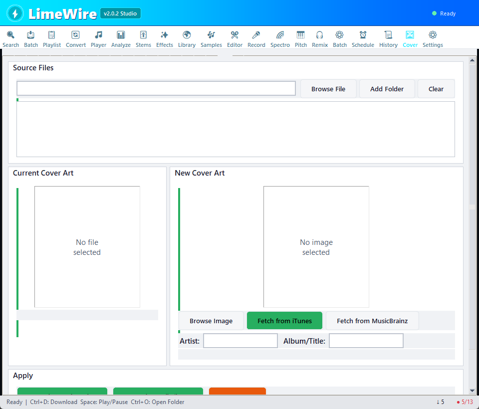
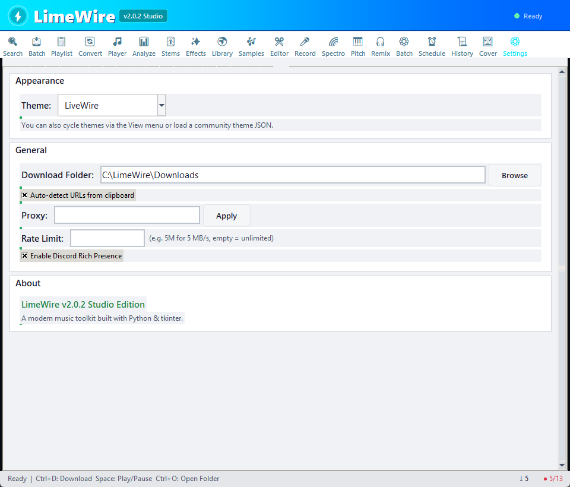

<div align="center">

<!-- Logo / Hero -->


<br>

# LimeWire Studio Edition

### The Swiss Army Knife of Audio Production

[](https://python.org)
[](LICENSE)
[](https://github.com/Ccwilliams314/LimeWire/stargazers)
[](https://github.com/Ccwilliams314/LimeWire/releases)

[](https://github.com/Ccwilliams314/LimeWire/actions)
[](https://github.com/Ccwilliams314/LimeWire/issues)


**Download &bull; Play &bull; Analyze &bull; Edit &bull; Separate &bull; Remix &bull; Process**

[Getting Started](#-quick-start) &bull; [Features](#-features) &bull; [Screenshots](#-screenshots) &bull; [Themes](#-themes) &bull; [Architecture](#-architecture)

</div>

---

## What is LimeWire?

A **20-tab all-in-one audio production studio** built with Python and tkinter. From simple YouTube downloads to AI-powered stem separation, professional audio analysis, non-destructive editing, and batch processing — all in a single app with 13 themes and 6 languages.

### Headline Features

| | Feature | What it does |
|---|---------|-------------|
| :arrow_down: | **1000+ Site Downloads** | YouTube, Spotify, SoundCloud, Bandcamp via yt-dlp |
| :brain: | **AI Stem Separation** | Vocals, drums, bass, guitar, piano via Demucs |
| :bar_chart: | **Audio Analysis** | BPM, key, Camelot, LUFS, waveform, spectrogram |
| :mag: | **Track Identification** | Shazam, MusicBrainz, Chromaprint, Apple Music |
| :scissors: | **Non-Destructive Editor** | Cut, trim, fade, merge with full undo/redo |
| :microphone: | **Recording + Whisper** | Mic capture with AI transcription and SRT export |
| :control_knobs: | **Effects Chain** | Gain, compressor, reverb, delay, chorus, filters |
| :musical_score: | **Stem Remixer** | Per-stem volume, pan, mute/solo mixing console |
| :zap: | **Batch Processor** | Normalize, convert, fade, trim silence at scale |
| :art: | **13 Live Themes** | Switch instantly — no restart, includes custom theme loader |

---

## :rocket: Quick Start

```bash
# Prerequisites: Python 3.10+ and FFmpeg on PATH
winget install ffmpeg

# Core install (download + playback)
pip install yt-dlp pillow requests mutagen pyglet

# Launch
python LimeWire.py
# or: python -m limewire
```

<details>
<summary><strong>Optional modules — install only what you need</strong></summary>

```bash
pip install librosa soundfile pyloudnorm   # BPM/key/loudness analysis
pip install musicbrainzngs pyacoustid      # Track identification
pip install shazamio                       # Shazam (Python <=3.12)
pip install demucs                         # AI stem separation (needs PyTorch)
pip install pydub sounddevice pyrubberband # Editing & recording
pip install openai-whisper                 # Whisper transcription
pip install pedalboard                     # Audio effects (Spotify)
pip install pyflp                          # FL Studio integration
pip install tkinterdnd2                    # Drag & drop
```

**All-in-one:**
```bash
pip install yt-dlp pillow requests mutagen pyglet librosa soundfile pyloudnorm musicbrainzngs pyacoustid demucs pydub sounddevice pyrubberband openai-whisper pedalboard
```

> The status bar shows module count (e.g., `12/14`). Click it to see what's missing.

</details>

### Windows One-Click Setup

```bash
# Run the automated installer
setup.bat
```

---

## :camera: Screenshots

<details open>
<summary><strong>All 20 tabs</strong></summary>

<table>
<tr>
<td width="50%"><strong>Search & Grab</strong><br></td>
<td width="50%"><strong>Batch Download</strong><br></td>
</tr>
<tr>
<td><strong>Playlist</strong><br></td>
<td><strong>Converter</strong><br></td>
</tr>
<tr>
<td><strong>Player</strong><br></td>
<td><strong>Analyze</strong><br></td>
</tr>
<tr>
<td><strong>Stems (AI)</strong><br></td>
<td><strong>Effects</strong><br></td>
</tr>
<tr>
<td><strong>Discovery</strong><br></td>
<td><strong>Samples</strong><br></td>
</tr>
<tr>
<td><strong>Editor</strong><br></td>
<td><strong>Recorder</strong><br></td>
</tr>
<tr>
<td><strong>Spectrogram</strong><br></td>
<td><strong>Pitch/Time</strong><br></td>
</tr>
<tr>
<td><strong>Remixer</strong><br></td>
<td><strong>Batch Process</strong><br></td>
</tr>
<tr>
<td><strong>Scheduler</strong><br></td>
<td><strong>History</strong><br></td>
</tr>
<tr>
<td><strong>Cover Art</strong><br></td>
<td><strong>Settings</strong><br></td>
</tr>
</table>

</details>

---

## :sparkles: Features

### Download & Library

| Tab | Capabilities |
|-----|-------------|
| **Search & Grab** | Paste any URL, auto-detect source, choose format (MP3/WAV/FLAC/OGG/M4A/AAC/OPUS), quality selector |
| **Batch Download** | Queue multiple URLs, persistent queue, retry failed, progress tracking |
| **Playlist** | YouTube playlist fetch, individual track selection, batch download |
| **Converter** | Format conversion via ffmpeg, metadata preservation |
| **History** | Searchable download log with replay and management |
| **Scheduler** | Schedule downloads for specific times with background polling |
| **Cover Art** | View, add, fetch (iTunes/MusicBrainz), batch-apply album artwork |

### Playback & Analysis

| Tab | Capabilities |
|-----|-------------|
| **Player** | Waveform display, EQ spectrum, album art, speed control, A-B loop, crossfade, M3U playlists |
| **Analyze** | BPM, key, Camelot, LUFS, true peak. Shazam/MusicBrainz/Chromaprint/Apple Music identification |
| **Discovery** | Library scanner, BPM/key caching, harmonic mixing suggestions, smart playlists, CSV export |
| **Spectrogram** | Linear/Mel/CQT with viridis/magma/plasma/inferno colormaps, PNG export |

### Production & Editing

| Tab | Capabilities |
|-----|-------------|
| **Stems** | AI separation via Demucs (htdemucs, htdemucs_ft, mdx_extra) — vocals, drums, bass, other, piano, guitar |
| **Remixer** | Mix stems: per-stem volume (0-150%), pan (L-R), mute/solo, preview, export |
| **Editor** | Non-destructive trim/cut/fade/merge, undo/redo, waveform selection, 32x zoom |
| **Recorder** | Mic recording, VU meter, live waveform, Whisper AI transcription, SRT export |
| **Pitch/Time** | Pitch shift (semitones), time stretch, BPM auto-detect, vocal isolation |
| **Effects** | Pedalboard chain: gain, compressor, limiter, reverb, delay, chorus, filters. Save/load presets |
| **Batch Process** | Bulk normalize LUFS, convert format, fade in/out, trim silence, strip metadata |
| **Samples** | Freesound.org browser with preview and download |

### Settings & Customization

- **13 built-in themes** with instant live switching (no restart)
- **Community theme loader** — load custom JSON themes via Tools menu
- **Skin Customizer** (`skin_customizer.py`) — visual theme editor with live preview
- **6 languages** — English, Spanish, French, German, Japanese, Portuguese
- **Plugin system** — SHA-256 hash-trusted custom audio processors
- **VST3/AU hosting** — load VST3 plugins in the effects chain
- **MIDI Learn** — map hardware controllers in the Remixer
- **Discord Rich Presence** — show currently playing track
- **Cloud sync** — export/import settings to Dropbox/OneDrive/Google Drive

---

## :keyboard: Keyboard Shortcuts

| Shortcut | Action |
|----------|--------|
| `Ctrl+K` | Command Palette — fuzzy search pages, history, library |
| `Ctrl+D` | Download / Grab URL |
| `Ctrl+O` | Open downloads folder |
| `Space` | Play / Pause |
| `Ctrl+Right/Left` | Next / Previous track |
| `Ctrl+Up/Down` | Volume up / down |
| `Shift+Escape` | Quick close |
| `Ctrl+?` | Show shortcuts dialog |

---

## :art: Themes

13 built-in themes with **instant live switching** — no restart required:

| Theme | Preview |
|-------|---------|
| **LiveWire** (default) | Electric cyan on dark navy |
| **Light** | Clean white, green accents |
| **Dark** | Rich dark, green accents |
| **Modern** | GitHub-inspired, high contrast |
| **Synthwave** | Neon pink/purple retro |
| **Dracula** | Purple/pink, dev favorite |
| **Catppuccin** | Soft pastels, easy on the eyes |
| **Tokyo Night** | Blue-tinted calm palette |
| **Spotify** | Green on black |
| **Classic** | OG lime green nostalgia |
| **Nord** | Arctic blue-grey |
| **Gruvbox** | Warm retro earth tones |
| **High Contrast** | Maximum accessibility |

Each theme defines **37 semantic color tokens** (backgrounds, text, accents, borders, cards, states, surfaces, focus rings) for pixel-perfect consistency across all 20 tabs.

**Create your own:** Run `python skin_customizer.py` to visually design custom themes and export them as JSON files loadable via **Tools > Load Community Theme**.

---

## :building_construction: Architecture

LimeWire ships as both a **modular package** (`limewire/`) and a backward-compatible **single-file launcher** (`LimeWire.py`):

```
LimeWire/
  LimeWire.py                 # Thin launcher (backward compat)
  skin_customizer.py          # Visual theme editor
  limewire/
    __init__.py               # __version__ = "3.0.0"
    __main__.py               # python -m limewire
    app.py                    # App(tk.Tk) main class
    core/
      theme.py                # T namespace, 13 themes, apply_theme()
      constants.py            # Timing, dimension, format constants
      config.py               # JSON persistence, file paths
      platform.py             # OS detection
      deps.py                 # Optional dependency flags & lazy loaders
      audio_backend.py        # Playback engine
    i18n/                     # 6-language localization
    utils/                    # Helpers, sanitization
    services/                 # Analysis, metadata, cover art, audio processing
    security/                 # Path confinement, subprocess allowlist, JSON validation
    ui/                       # Widgets, styles, tooltips, toasts, command palette
    pages/                    # 20 page classes (one per tab)
  tests/                      # 185 tests (pytest)
```

### Module Dependency Flow

```
core/ <-- utils/ <-- services/ <-- ui/ <-- pages/ <-- app.py
         ^                                              ^
     security/                                     __main__.py
```

Pages receive `app` as a constructor arg — they never import `app.py` directly. No circular imports.

### Security Layer

| Module | Purpose |
|--------|---------|
| `safe_paths.py` | Path traversal prevention, atomic writes, symlink checks |
| `safe_subprocess.py` | Binary allowlist (ffmpeg, ffprobe, yt-dlp only) |
| `safe_json.py` | Size limits (5 MB), depth checks (10), key allowlists |
| `plugin_policy.py` | SHA-256 hash trust — scan without execute |

### Data Files

All stored in `~/.limewire_*.json`: history, settings, schedule, queue, analysis cache, session state, recent files.

---

## :test_tube: Testing

```bash
pip install pytest
python -m pytest tests/ -v
```

**185 tests** covering security modules, core systems, utilities, and services.

---

## :wrench: Tech Stack

| | Component | Technology |
|---|-----------|-----------|
| :snake: | Language | Python 3.10+ (tested through 3.14) |
| :desktop_computer: | GUI | tkinter / ttk |
| :arrow_down: | Downloads | yt-dlp |
| :speaker: | Playback | pyglet |
| :label: | Metadata | mutagen |
| :gear: | Processing | pydub, ffmpeg |
| :bar_chart: | Analysis | librosa, pyloudnorm |
| :brain: | AI Stems | Demucs (Meta AI) |
| :musical_note: | Pitch/Time | pyrubberband |
| :microphone: | Recording | sounddevice |
| :speech_balloon: | Transcription | openai-whisper |
| :control_knobs: | Effects | pedalboard (Spotify) |
| :mag: | Track ID | shazamio, pyacoustid, musicbrainzngs |

---

## :books: Documentation

| Document | Description |
|----------|-------------|
| [Operations Manual (PDF)](LimeWire_v2.0_Operation_Manual.pdf) | Comprehensive guide with screenshots for every feature |
| [CONTRIBUTING.md](CONTRIBUTING.md) | Developer guide, project structure, how to contribute |
| [SECURITY.md](SECURITY.md) | Security policy, vulnerability scan report |
| [CHANGELOG.md](CHANGELOG.md) | Version history |
| [ROADMAP.md](ROADMAP.md) | Feature roadmap |

---

## :handshake: Contributing

1. Fork & clone
2. `pip install -r requirements.txt`
3. Create a branch, make changes
4. Run tests: `python -m pytest tests/ -v`
5. Submit a PR

See [CONTRIBUTING.md](CONTRIBUTING.md) for full details.

---

## :scroll: License

[MIT License](LICENSE) — free for personal and commercial use.

---

<div align="center">
<sub><em>"Definitely virus-free since 2024"</em></sub>
</div>
